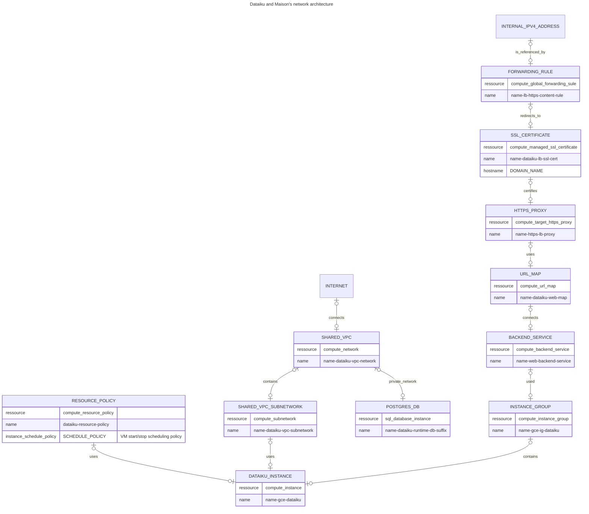
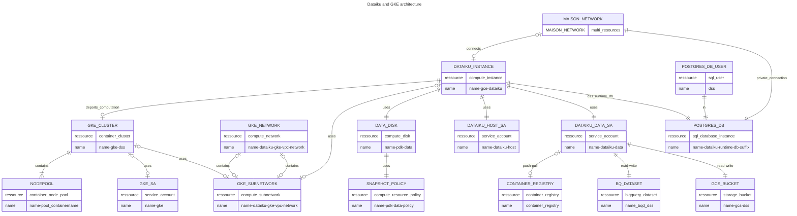
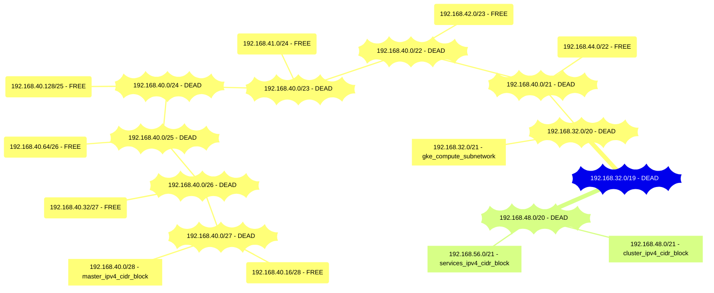
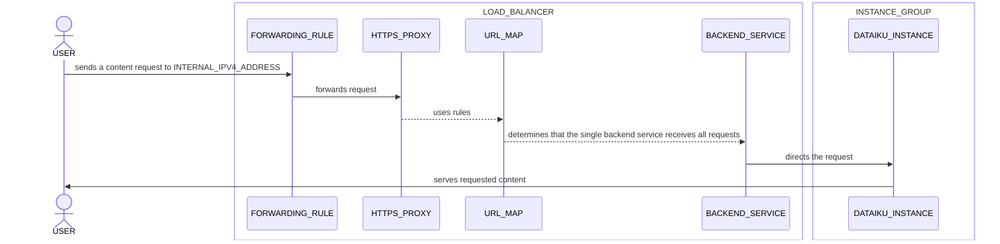

# dataiku

The Dataiku terraform module contains all the necessary infrastructure to deploy Dataiku within your GCP project. 

## Architecture

### Dataiku and Maison's network architecture

**Load balancer example topology**


**Figure**. HTTPS load balancer with a managed instance group (MIG) backend

### Dataiku and GKE architecture
name: Is the name set at creation.

#### Dataiku and GKE architecture

#### Dataiku and GKE network occupation
help: https://www.davidc.net/sites/default/subnets/subnets.html


## Load Balancer Sequence diagram



## Deployment Pre-requisites

Before deploying the Dataiku module running you need to perform the following pre-requisites actions to gather the values of the mandatory module input.

##### Shared VPC subnetwork

The Dataiku VM and the internal load balancer must be deployed in a secure shared VPC subnetwork. 

You need to ask your security team to give you:
- the shared VPC project ID
- the shared VPC name
- the shared VPC subnetwork
- the shared VPC subnetwork region
- have the shared VPC hook (shared) with the project in which you plan to deploy your Dataiku 
- give the role [Network User](https://cloud.google.com/compute/docs/access/iam#compute.networkUser) to the credentials you plan to use to deploy Dataiku infrastructure on the shared VPC project

###### Proxy-only Subnetwork
The shared VPC must have a proxy-only subnetwork properly configured in the same region of the Dataiku VM, see: [Set up an internal Application Load Balancer with Shared VPC  |  Load Balancing  |  Google Cloud](https://cloud.google.com/load-balancing/docs/l7-internal/l7-internal-shared-vpc#configure_the_proxy-only_subnet)  

See an example in [Shared vpc prerequisites example terraform file](example/prerequisites.sharedvpc.tf)

###### Firewall rules
The shared VPC must have the two followings firewall rules deployed with the corresponding target tags:
See an example in [Shared vpc prerequisites example terraform file](example/prerequisites.sharedvpc.tf)
```
# allow all access from IAP and health check ranges
resource "google_compute_firewall" "fw_iap" {
  project       = "<SHARED_VPC_PROJECT_ID>"
  name          = "<NAMING_CONVENTION>-atm-fw-allow-iap-hc"
  direction     = "INGRESS"
  network       = var.network
  source_ranges = ["130.211.0.0/22", "35.191.0.0/16", "35.235.240.0/20"]
  target_tags   = ["health-check-and-iap"]
  allow {
    protocol = "tcp"
  }
}

# allow http from proxy subnet to backends
resource "google_compute_firewall" "fw_ilb_to_backends" {
  project       = "<SHARED_VPC_PROJECT_ID>"
  name          = "<NAMING_CONVENTION>-atm-fw-allow-ilb-to-backends"
  direction     = "INGRESS"
  network       = var.network
  source_ranges = ["0.0.0.0/0"]
  target_tags   = ["http-server"]
  allow {
    protocol = "tcp"
    ports    = ["80", "443", "8080"]
  }
}
```
###### Cloud SQL private IP setup
The Shared VPC must have the following setup done to allow Cloud SQL access through private ip:
- A global internal address range for the peering
- A peering connection with the `servicenetworking.googleapis.com` service
See an example in [Shared vpc prerequisites example terraform file](example/prerequisites.sharedvpc.tf)

```
# Reserve global internal address range for the peering
resource "google_compute_global_address" "private_ip_address" {
  name          = <NAME>
  purpose       = "VPC_PEERING"
  address_type  = "INTERNAL"
  prefix_length = 16
  network       = <SHARED_VPC>
}

# Establish VPC network peering connection using the reserved address range
resource "google_service_networking_connection" "private_vpc_connection" {
  network                 = <SHARED_VPC>
  service                 = "servicenetworking.googleapis.com"
  reserved_peering_ranges = [google_compute_global_address.private_ip_address.name]
}
```
More informations here:
[Configure private IP  |  Cloud SQL for PostgreSQL  |  Google Cloud ](https://cloud.google.com/sql/docs/postgres/configure-private-ip) 
[Terraform example](https://github.com/gruntwork-io/terraform-google-sql/blob/v0.6.0/examples/postgres-private-ip/main.tf  ) 

##### SSL

A signed SSL certificate is required to deploy a new Dataiku, you can follow [these steps](https://cloud.google.com/load-balancing/docs/ssl-certificates/self-managed-certs#create-key-and-cert) to be guided on how-to create a new certificate.

Once your CSR is signed, you need to create 2 secrets in Secret Manager containing: 
- the SSL certificate (in PEM format)
- the private key (in PEM format)

See an example in [Secret ssl prerequisites example terraform file](example/prerequisites.secrets.ssl.tf)

The deployed Dataiku will be accessed through the domain name of the certificate you provide.

##### Single Sign-On (SSO)

For the SSO, as it is based on OpenID Connect (OIDC) you need to register a new OIDC Client (sometimes called an ‘application’) for the DSS in your identity provider (IdP, Okta).

Reach out to your Okta administrator and ask them to:
- create a new  OIDC Client of type 'web application'
- setup the OIDC client to use the _authorization code_ grant flow
- use the redirect URL which follows the pattern `https://YOUR_DOMAIN_NAME/login/openid-redirect-uri/`
- add the target users of your DSS
- give you the OIDC Client __Client ID__ and __Client secret__
  
&rarr; Finally, in Secret Manager of the same GCP project than the one you plan to deploy the Dataiku, create a new secret containing the OIDC __Client secret__ value.
See an example in [Secret okta prerequisites example terraform file](example/prerequisites.secrets.okta.tf)

#### Finalize configuration

##### DNS

You need to add a DNS record of type `A` linking the domain name referenced in your certificate with the IPv4 address returned as a terraform output. You can ask your domain name registrar to do it.

| Name | Description |
|------|-------------|
| <a name="output_forwarding_rule_ip"></a> [forwarding\_rule\_ip](#output\_forwarding\_rule\_ip) | n/a |
##### SSO

Once the DSS is ready to be used (i.e. its Compute Engine instance has its metadata `instance_state` at `PROVISIONED`), you can access your DSS by using your domain name.

The first time you access your DSS you have to enter your Dataiku license if you didn't use the `dataiku_license_secret_name` variable. You can then log in via SSO using the `dss_admin_email` you provided at creation.

To finalize the SSO configuration you need create the user accounts for this DSS, to do so, once your connected:

- From the __Administration__ menu, navigate to the __Security__ tab
- Select __New User__
- For __Login__ you _must_ enter the __email__ address of your user (that will be used for the SSO authentification)
- For __Type__ you _must_ select "SSO"
- You also need to provide a value for __Display name__, the other fields are optional and should be configured as your prefererence

> **_NOTE:_*You can programmatically create users with the [Dataiku API](https://doc.dataiku.com/dss/latest/python-api/users-groups.html#a-user-who-will-login-through-sso)

## Technical notes

The Dataiku DSS is accessible from your intranet through a single endpoint: the domain name referenced in the certificate you provided.

> **_NOTE:_** The shared VPC must have a proxy-only subnetwork configured in the same region of the Dataiku VM (see: [configuring a proxy-only subnet](https://cloud.google.com/load-balancing/docs/l7-internal/l7-internal-shared-vpc#configure_the_proxy-only_subnet)). The [DNS configuration](#dns) must also be done.

The data disk of the DSS is automatically snapshot every 12 hours, the snapshots are retained during 10 days.

The Dataiku main processes' logs are routed to Cloud Logging. By default the logging level is "INFO", this can be modified by changing the value of the metadata `log_level` of the Compute Engine instance, the change is applied at VM restart. 

> **_WARNING:_** If you rely on an existing Cloud SQL instance for the [runtime databases](https://doc.dataiku.com/dss/latest/operations/runtime-databases.html) of your DSS, the deletion of this Cloud SQL instance will lead to all the Dataiku using this instance losing their runtime databases.

## Startup script

The DSS is provisioned and upgraded thanks to the startup script defined in the compute instance metadata `gce_startup_script`.
The startup script clones subscripts from this repository: [atom-dataiku-setup](https://github.com/lvmh-data/atom-dataiku-setup) and executes `./setup.sh`.

By default the startup script version used to provision and upgrade the VM is the latest which was available when you did your `terraform apply`. 

### Update DSS and startup script
You can use the variable `dataiku_setup_version` to change the startup script version used to provision and upgrade the VM.
This can be useful to update the DSS version or other components installed by the startup script.

Please refer to the repository's [README](https://github.com/lvmh-data/atom-dataiku-setup#readme) and the startup script's [RELEASE page](https://github.com/lvmh-data/atom-dataiku-setup/releases) for more information.

## GKE

To deploy GKE capabilities the dataiku module use the gke module.
Find more informations on the related [README](../gke/README.md)

## Fusion

Migrate an existing Atom v1 Dataiku instance. The original Fusion process use the atm CLI to perform the fusion: [atm su dataiku fusion](https://github.com/lvmh-data/atom-atm/blob/main/src/atm/su/dataiku/fusion/README.md)

To perform the fusion without the cli you need to provide the `fusion_*`` inputs:
See an example in the [Example terraform file](./example/main.tf)

| Name | Description | Type | Default | Required |
|------|-------------|------|---------|:--------:|
| <a name="input_source_bigquery_dataset"></a> [source\_bigquery\_dataset](#input\_source\_bigquery\_dataset) | Fusion: BigQuery dataset to import (no-copy). Old-Dataiku bigquery dataset to import for the Dataiku deployed. | <pre>object({<br>    dataset_id                  = string<br>    location                    = string<br>    friendly_name               = string<br>    description                 = string<br>  })</pre> | `null` | no |
| <a name="input_source_data_disk"></a> [source\_data\_disk](#input\_source\_data\_disk) | Fusion: Source disk to import (copy). Old-Dataiku data disk to use as a source for the Dataiku deployed. Format: https://registry.terraform.io/providers/hashicorp/google/latest/docs/resources/compute_disk#source_disk | `string` | `null` | no |
| <a name="input_source_storage_bucket"></a> [source\_storage\_bucket](#input\_source\_storage\_bucket) | Fusion: Storage bucket to import (no-copy). Old-Dataiku GCS bucket to import for the Dataiku deployed. | <pre>object({<br>    name  = string<br>    location  = string<br>  })</pre> | `null` | no |

### Import

After the deployment you need to import the resources:
- Bigquery Dataset
- Storage Bucket
into your terraform states file using the [Terraform import commande](https://developer.hashicorp.com/terraform/cli/commands/import)

Example:

`terraform import -var-file {var-file} module.src_atm_dataiku_dataiku_{name}.google_bigquery_dataset.main ID_source_bigquery_dataset`


`terraform import -var-file {var-file} module.src_atm_dataiku_dataiku_{name}.google_storage_bucket.main ID_source_storage_bucket`

### Remove the old dataiku instance

For the next steps please refer to the atm fusion reame:
[Remove the old dataiku instance](https://github.com/lvmh-data/atom-atm/blob/main/src/atm/su/dataiku/fusion/README.md#3-remove-the-old-dataiku-instance)


## See also

The documentation related to dataiku deployment with atm CLI: [README](https://github.com/lvmh-data/atom-atm/blob/main/src/atm/dataiku/README.md)
